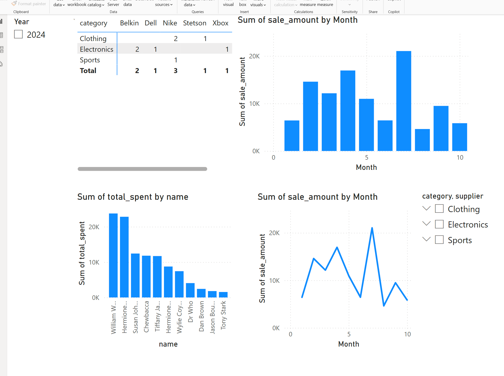
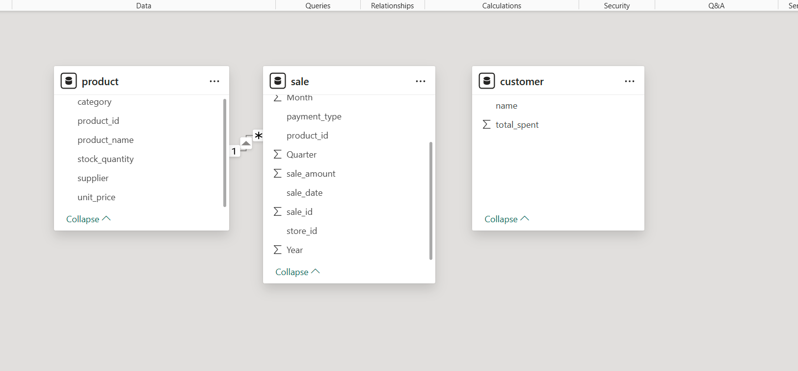
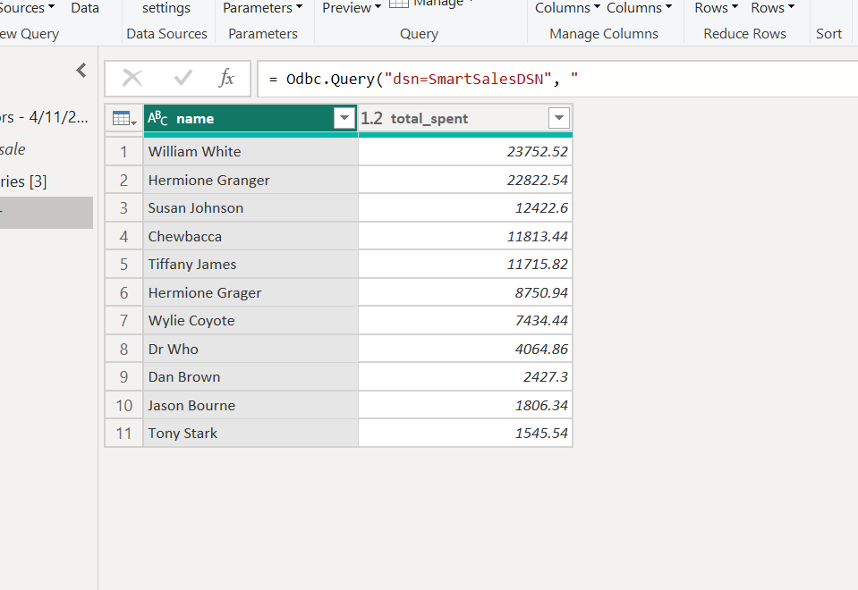
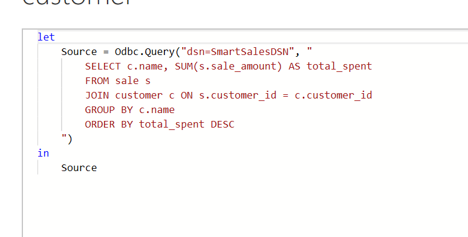

# Smart Store Seabaugh

## Smart Sales Starter Files
Starter files to initialize the Smart Sales project.

---

## Project Setup Guide

### Setup for All Platforms
Run all commands from a terminal in the root project folder.

#### Step 1A - Create a Local Project Virtual Environment
    python3 -m venv .venv

#### Step 1B - Activate the Virtual Environment

- Mac/Linux:
    source .venv/bin/activate

- Windows:
    .venv\Scripts\activate

#### Step 1C - Install Required Packages
    python3 -m pip install --upgrade -r requirements.txt

#### Step 1D - Optional: Verify Virtual Environment Setup
    python3 -m datafun_venv_checker.venv_checker

#### Step 1E - Run the Initial Project Script
    python3 scripts/data_prep.py

---

## Database Schema & Design Choices

This project uses a **star schema** for organizing the SQLite sales data warehouse. The **fact table** (`sale`) records transactions, and the **dimension tables** (`customer`, `product`) provide lookup and filtering capabilities.

### Schema Overview

#### 🧾 customer Table

| Column             | Type     | Description                                 |
|--------------------|----------|---------------------------------------------|
| customer_id        | INTEGER  | Primary key                                 |
| name               | TEXT     | Full name of the customer                   |
| region             | TEXT     | Geographic region                           |
| join_date          | TEXT     | Date the customer joined                    |
| loyalty_points     | REAL     | Loyalty point balance                       |
| preferred_contact  | TEXT     | Preferred contact method                    |

#### 📦 product Table

| Column             | Type     | Description                                 |
|--------------------|----------|---------------------------------------------|
| product_id         | INTEGER  | Primary key                                 |
| product_name       | TEXT     | Name of the product                         |
| category           | TEXT     | Product category                            |
| unit_price         | REAL     | Price per unit                              |
| stock_quantity     | INTEGER  | Available stock                             |
| supplier           | TEXT     | Supplier name                               |

#### 💰 sale Table *(Fact Table)*

| Column             | Type     | Description                                 |
|--------------------|----------|---------------------------------------------|
| sale_id            | INTEGER  | Primary key                                 |
| customer_id        | INTEGER  | Foreign key → customer.customer_id          |
| product_id         | INTEGER  | Foreign key → product.product_id            |
| store_id           | INTEGER  | Store where the sale occurred               |
| campaign_id        | INTEGER  | Marketing campaign identifier               |
| sale_amount        | REAL     | Total sale amount                           |
| sale_date          | TEXT     | Date of the sale                            |
| discount_percent   | REAL     | Discount applied                            |
| payment_type       | TEXT     | Method of payment                           |

---
## Visualizations and SQL Queries
### 💡 Key Queries:
- **Top Customers:**
  ```sql
  SELECT c.name, SUM(s.amount) AS total_spent
  FROM sale s
  JOIN customer c ON s.customer_id = c.customer_id
  GROUP BY c.name
  ORDER BY total_spent DESC

### Visuals





## OLAP Goal: Top Selling Products Analysis
### Section 1. The Business Goal
The goal of this project is to analyze sales data over time and identify which product sold the most in each region every week. This analysis will help us understand sales patterns across different regions and timeframes, allowing businesses to make informed decisions on product supply and pricing strategies. By identifying top-selling products, businesses can optimize their inventory and pricing to meet demand more effectively. <br>

**Why it matters:**

- Identifying high-demand products in specific regions allows businesses to adjust inventory levels and ensure that popular items are sufficiently stocked.

- Understanding sales trends over time helps businesses to adjust pricing or promotions to maximize revenue and respond to market conditions.

### Section 2. Data Source
The data source for this analysis is a sales database stored in a SQLite data warehouse (smart_sales.db). It contains information about product sales transactions, product details, and customer data.<br>

**Columns Used:**

- sale_id (from sale table): Unique identifier for each sale.

- sale_date (from sale table): Date when the sale occurred.

- sale_amount (from sale table): The total value of the sale.

- unit_price (from product table): Price per unit of the product.

- product_name (from product table): Name of the product sold.

- category (from product table): Category to which the product belongs.

- region (from customer table): Region where the customer is located.

### Section 3. Tools
**The following tools were used in this project:**

- Pandas:

    - Used for data manipulation and analysis (e.g., calculating quantities, grouping data, and performing aggregations).

- SQLite:

    - The database used to store sales data. SQL queries were used to extract the relevant information.

- Matplotlib & Seaborn:

    - Used for data visualization to create bar charts, line charts, and pie charts.

- Python:

    - The programming language used to develop the logic and run the entire workflow.


### Section 4. Workflow & Logic
**Dimensions and Aggregations:**
- Dimensions:

    - Region: The geographical region where the product was sold.

    - Week: The week in which the sale occurred, represented by the year-week format.

    - Product: The specific product sold.

- Aggregations:

    - Total quantity sold: This is calculated by dividing the sale_amount by the unit_price and rounding it to the nearest integer.

    - The top-selling product for each region and week is identified by finding the maximum quantity sold.

**Logic for the Analysis:**
- Data Extraction:

    - SQL queries are executed to retrieve data from the sale, product, and customer tables.

- Data Processing:

    - The sale_amount and unit_price are used to calculate the quantity of each product sold in each transaction.

    - The data is then grouped by region and week to calculate total quantities sold for each product.

- Top-Selling Product Calculation:

    - For each region and week, we identify the product with the maximum quantity sold.

- OLAP Cube:

    - An OLAP-like pivot table is created to present the sales data for each product across different regions and weeks.

- Visualizations:

    - Bar chart: Displays the total quantity sold for each product across different weeks.

    - Line chart: Shows the trend of sales for top-selling products over time.


### Section 5. Results
**The analysis shows the following insights:**

- The top-selling products vary by region, with some products performing exceptionally well in certain areas.

- Sales trends over time reveal which products are consistently popular and which may require promotional efforts to increase demand.

- The pie chart for the latest week shows the distribution of product sales, helping to identify which products should be prioritized for supply.

**Example Insights:**
- Product A had the highest sales in the East region for the last two weeks.

- The line chart revealed that Product B’s sales are consistently increasing week over week, suggesting that it may be gaining popularity.

### Section 6. Suggested Business Action
- Based on the analysis, the following actions are recommended:

- Stock Optimization: Increase the supply of top-selling products in regions where they are in high demand.

- Pricing Strategy: Consider adjusting the pricing of products that are consistently popular, potentially increasing prices to improve margins.

- Promotions: Focus promotional efforts on products that have been identified as high performers, or boost the demand for low-performing products by introducing discounts or targeted marketing.

### Section 7. Challenges
**Some challenges encountered during the project included:**

- Data Aggregation: The logic for determining the top-selling product per week required careful aggregation to avoid errors in identifying the most sold product.

- Visualization: Ensuring that the charts accurately represented the top-selling products and that the pie chart did not include non-numeric columns caused some initial confusion.

**Resolution:**

- Missing data was handled by filtering out incomplete transactions or imputing missing values when necessary.

- Aggregation logic was refined by ensuring that the grouping and sorting were correct.

- Visualization issues were resolved by ensuring that only numeric values were included in the pie chart.

## BI Goal with Dashboard
### Section 1. The Business Goal
Which product category is the top selling in each region? Is there a particular product we should be focusing on?

### Section 2. Data Source
All data can be found in the data file in the Data Warehouse data/dw/smart_sales.db

### Section 3. Tools Used
- Power BI to create the dashboard
- SQLite3 for the database
- Python Libraries to handle transforming/cleaning data

### Section 4. Workflow & Logic
- Started with a goal and hypothesis
- Looking through data to find possible features needed
- Applied features in several different graphs to generate and display insights

### Section 5. Results (narrative + visualizations)
- Laptops were the top selling product in each region and the top selling product overall
- Jackets were the second highest; however, it wasn't close to the sale amount from laptops

### Section 6. Suggested Business Action
Focus more on producing Laptops and possibly expand more into the tech sector. Advertise our laptops more in the North region to generate more sales with laptops. 
### Section 7. Challenges
- Figuring out which visualizations to utilize
- Properly displaying each chart with the correct features

### Section 8. Ethical Considerations
I did not include any customer information in the dashboard because I feel that they have a right to privacy and that it would not impact the results anyway. 

[Visualization Dashboard](image.png)

## Git Workflow

After making changes, use the following commands to commit and push updates to GitHub:

    # git add .
    # git commit -m "Update README with schema"
    # git push

Modify the commit message to describe your changes appropriately.

---

## Markdown Preview

To preview this `README.md` file in VS Code:
- Open the file.
- Press `Ctrl + Shift + V` (Windows/Linux) or `Cmd + Shift + V` (Mac).
- Or click the "Open Preview" button in the top-right corner.

---

## Need Help?

For issues or troubleshooting, reach out via discussion forums or the project repository.

Happy coding! 🚀
